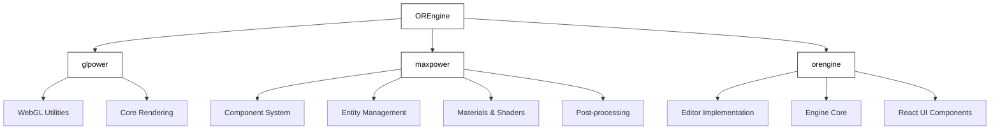
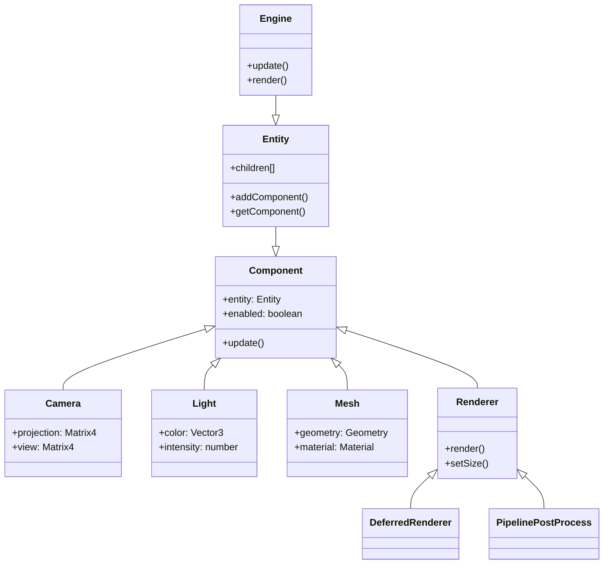

# システム全体概要

## OREngineとは

OREngineは**64KB intro demo制作**を目的とした軽量WebGL 3Dエンジンです。TypeScriptで構築され、エンティティ・コンポーネントシステムをベースにしたモジュラーな設計により、柔軟な3Dアプリケーション開発を可能にします。

### 主な特徴

1. **64KB制約への最適化**
   - 積極的なコード圧縮とシェーダー最小化
   - カスタムViteプラグインによるビルド最適化
   - プロパティ名マングルによるサイズ削減

2. **モジュラー設計**
   - 3つの独立したパッケージによる責務分離
   - プラグインによる拡張性
   - 疎結合な構造による保守性

3. **コンポーネントベースアーキテクチャ**
   - 再利用可能なコンポーネント
   - 柔軟な機能の組み合わせ
   - シリアライズ可能な構造

4. **最新技術の活用**
   - TypeScriptによる型安全性
   - WebGL 2.0の活用
   - Reactとの統合

## システム構成

OREngineは3つの主要なパッケージで構成されています：



### パッケージの役割

#### 1. glpower
基礎的なWebGLユーティリティと描画機能を提供します：
- WebGL基本操作
- シェーダー管理
- バッファ制御
- テクスチャ管理

#### 2. maxpower
glpowerの上に構築された高レベルな機能を提供します：
- コンポーネントシステム
- エンティティ管理
- ジオメトリプリミティブ
- マテリアルとシェーダー
- ポストプロセス効果
- アセットローダー（GLTF等）

#### 3. orengine
エンジン全体を統合するメインパッケージです：
- エディタの実装
- エンジンコア機能
- React UIコンポーネント

## コアシステム

### Engine

エンジン全体を管理する中心的なクラスです：

**主要な責務:**
1. **シーン管理**
   - エンティティの追加/削除
   - シーングラフの更新
   - コンポーネントのライフサイクル管理

2. **レンダリング制御**
   - レンダリングパイプラインの実行
   - カメラ設定の管理
   - シャドウマップの生成

3. **リソース管理**
   - テクスチャの読み込みと管理
   - シェーダーの管理
   - ジオメトリデータの管理

### Entity

階層構造を持つシーングラフの基本単位です：

```typescript
class Entity {
  position: Vector3;
  rotation: Quaternion;
  scale: Vector3;
  matrix: Matrix4;

  // 変換管理
  updateMatrix() {
    // ローカル変換行列の更新
  }

  updateMatrixWorld() {
    // ワールド変換行列の更新
  }

  // コンポーネント管理
  addComponent<T extends Component>(componentClass: new () => T): T;
  getComponent<T extends Component>(componentClass: new () => T): T | null;
  removeComponent<T extends Component>(componentClass: new () => T): void;
}
```

**主要機能:**
- 3D空間での位置/回転/スケールの管理
- コンポーネントの保持と管理
- 親子関係の制御

### Component

エンティティに機能を追加するモジュールです：

```typescript
class Component {
  // 初期化時に呼び出される
  initialize(): void;

  // 毎フレーム更新時に呼び出される
  update(dt: number): void;

  // レンダリング前に呼び出される
  beforeRender(): void;

  // レンダリング後に呼び出される
  afterRender(): void;

  // コンポーネント破棄時に呼び出される
  dispose(): void;
}
```

**主要機能:**
- 特定の機能（レンダリング、物理、カメラなど）を実装
- エンティティとの連携
- ライフサイクル管理

## システムアーキテクチャ図



## イベントシステム

コンポーネント間の通信とシステム全体のイベント管理を提供します：

```typescript
interface EventEmitter {
  on(event: string, callback: Function): void;
  off(event: string, callback: Function): void;
  emit(event: string, ...args: any[]): void;
}
```

### 主要なイベント

**エンティティイベント:**
- componentAdded
- componentRemoved
- childAdded
- childRemoved

**システムイベント:**
- update
- beforeRender
- afterRender
- resize

## パフォーマンス最適化

1. **フラスタムカリング**
   - ビューフラスタムによる表示判定
   - オクルージョンカリング

2. **バッチ処理**
   - インスタンシング
   - ドローコールの最適化

3. **キャッシング**
   - ジオメトリキャッシュ
   - テクスチャキャッシュ
   - シェーダーキャッシュ

## 次のセクション

- [02. パッケージ構成](./02-package-structure.md) - 各パッケージの詳細な構造
- [03. レンダリングパイプライン](./03-rendering-pipeline.md) - レンダリングシステムの詳細
- [04. ビルド最適化](./04-build-optimization.md) - 64KB制約への対応
- [05. 改善提案](./05-improvement-roadmap.md) - 今後の改善計画
