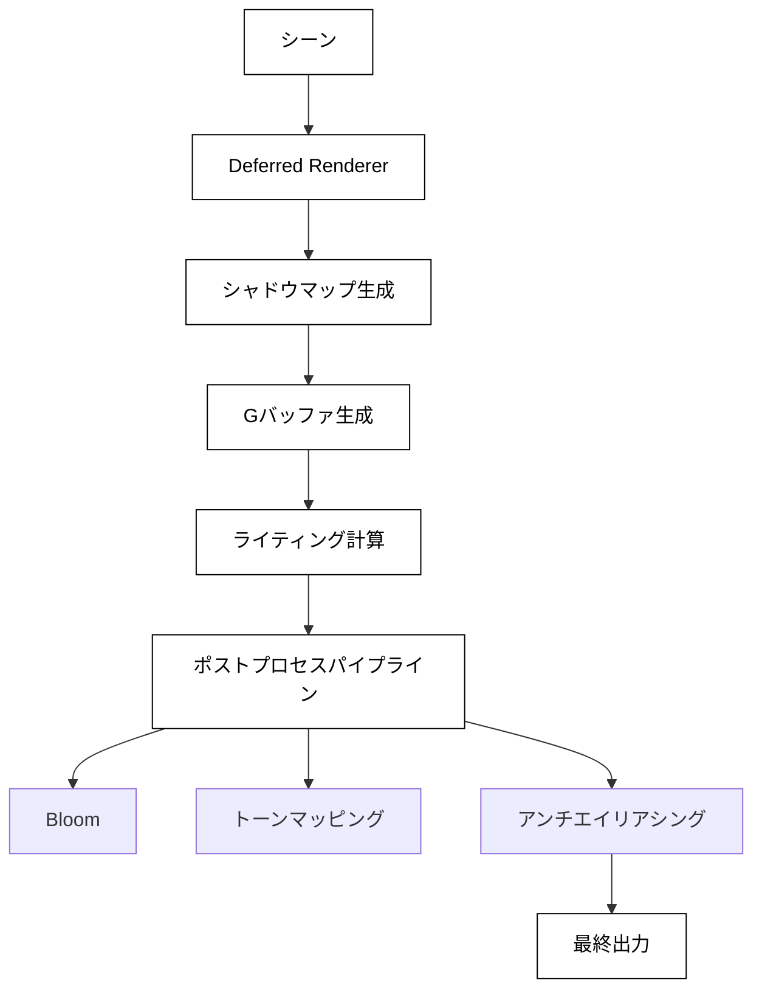

# レンダリングパイプライン

## 概要

OREngineはディファードレンダリングをベースとした高度なレンダリングパイプラインを採用しています。このアーキテクチャにより、複数のライトや高品質なポストプロセス効果を効率的に処理できます。

## レンダリングフロー



## レンダリングステージ

### 1. シャドウマップ生成

ライトの視点からシーンを描画してシャドウマップを生成します。

**処理内容:**
- ディレクショナルライト、ポイントライト、スポットライトのシャドウマップ
- カスケードシャドウマップ（CSM）対応
- PCF（Percentage Closer Filtering）によるソフトシャドウ

**最適化:**
- ライトが変更された場合のみ更新（`_lightsUpdated`フラグ）
- 必要最小限の解像度で生成
- フラスタムカリングによる描画オブジェクトの削減

```typescript
// シャドウマップレンダリング
private renderShadowMaps(stack: RenderStack) {
  for (const light of stack.lights) {
    if (light.castShadow) {
      this.renderToShadowMap(light, stack.renderables);
    }
  }
}
```

### 2. G-Buffer生成

ジオメトリパスでシーン情報をテクスチャに書き込みます。

**G-Bufferの構成:**

| バッファ | 内容 | フォーマット |
|---------|------|------------|
| GBuffer0 | RGB: アルベド, A: メタリック | RGBA |
| GBuffer1 | RGB: ワールド法線, A: ラフネス | RGBA |
| GBuffer2 | RGB: ワールド座標, A: エミッシブ | RGBA |
| Depth | デプス情報 | Depth24Stencil8 |

**シェーダー例:**
```glsl
// Fragment Shader (Geometry Pass)
layout(location = 0) out vec4 gAlbedoMetallic;
layout(location = 1) out vec4 gNormalRoughness;
layout(location = 2) out vec4 gPositionEmissive;

void main() {
  gAlbedoMetallic = vec4(albedo, metallic);
  gNormalRoughness = vec4(normalize(vNormal), roughness);
  gPositionEmissive = vec4(vWorldPosition, emissive);
}
```

### 3. ライティング計算

G-Bufferからデータを読み取り、PBRベースのライティングを計算します。

**ライティングモデル:**
- Cook-Torrance BRDF
- 物理ベースの反射・拡散計算
- Image-Based Lighting (IBL)
- 環境光

**処理フロー:**
```typescript
// ライティングパス
private renderLighting(camera: Camera, stack: RenderStack) {
  // フルスクリーンクワッドで描画
  this.lightingShader.use();

  // G-Bufferをテクスチャとしてバインド
  this.lightingShader.setTexture('gAlbedoMetallic', this.gBuffer0);
  this.lightingShader.setTexture('gNormalRoughness', this.gBuffer1);
  this.lightingShader.setTexture('gPositionEmissive', this.gBuffer2);

  // ライト情報を設定
  this.setLightUniforms(stack.lights);

  this.drawFullscreenQuad();
}
```

**PBRシェーダー（簡略版）:**
```glsl
// Fragment Shader (Lighting Pass)
vec3 calculatePBR(vec3 albedo, float metallic, float roughness,
                  vec3 N, vec3 V, vec3 L) {
  vec3 H = normalize(V + L);
  float NdotV = max(dot(N, V), 0.0);
  float NdotL = max(dot(N, L), 0.0);
  float NdotH = max(dot(N, H), 0.0);

  // Cook-Torrance BRDF
  float D = DistributionGGX(N, H, roughness);
  float G = GeometrySmith(N, V, L, roughness);
  vec3 F = FresnelSchlick(NdotV, mix(vec3(0.04), albedo, metallic));

  vec3 specular = (D * G * F) / max(4.0 * NdotV * NdotL, 0.001);
  vec3 diffuse = (1.0 - F) * (1.0 - metallic) * albedo / PI;

  return (diffuse + specular) * NdotL;
}
```

### 4. 環境マップ

環境反射やスカイボックスのレンダリングを行います。

**機能:**
- キューブマップベースの環境反射
- 事前計算された放射照度マップ
- スペキュラIBL
- 動的環境マップの更新（オプション）

```typescript
// 環境マップレンダリング
private renderEnvironmentMap(stack: RenderStack) {
  if (this.envMap) {
    this.envMapShader.use();
    this.envMapShader.setTexture('envMap', this.envMap);
    this.drawSkybox();
  }
}
```

## ポストプロセスパイプライン

複数のポストプロセス効果を順次適用します。

### PostProcessPipelineコンポーネント

```typescript
export class PostProcessPipeline extends Component {
  private stages: PostProcessStage[] = [];

  public addStage(stage: PostProcessStage) {
    this.stages.push(stage);
  }

  public render(inputTexture: Texture) {
    let current = inputTexture;

    for (const stage of this.stages) {
      if (stage.enabled) {
        current = stage.render(current);
      }
    }

    return current;
  }
}
```

### 主要なポストプロセス効果

#### 1. Bloom（グロー効果）

**処理ステップ:**
1. 輝度抽出（threshold以上のピクセルを抽出）
2. ダウンサンプリング
3. ガウスブラー（複数パス）
4. アップサンプリング
5. 元画像と合成

```glsl
// 輝度抽出
vec3 luminance = texture(inputTexture, vUv).rgb;
float brightness = dot(luminance, vec3(0.2126, 0.7152, 0.0722));

if (brightness > threshold) {
  outColor = vec4(luminance, 1.0);
} else {
  outColor = vec4(0.0, 0.0, 0.0, 1.0);
}
```

#### 2. トーンマッピング

HDRからLDRへの変換を行います。

**対応トーンマッピング:**
- Reinhard
- ACES Filmic
- Uncharted 2
- カスタムカーブ

```glsl
// ACES Filmic Tone Mapping
vec3 ACESFilm(vec3 x) {
  float a = 2.51;
  float b = 0.03;
  float c = 2.43;
  float d = 0.59;
  float e = 0.14;
  return clamp((x * (a * x + b)) / (x * (c * x + d) + e), 0.0, 1.0);
}

void main() {
  vec3 hdrColor = texture(inputTexture, vUv).rgb;
  vec3 mapped = ACESFilm(hdrColor * exposure);
  outColor = vec4(mapped, 1.0);
}
```

#### 3. SSAO（Screen Space Ambient Occlusion）

**処理フロー:**
1. 法線とデプスからワールド座標を復元
2. ランダムなサンプル点で遮蔽を計算
3. ブラーでノイズを軽減
4. 最終画像と合成

#### 4. アンチエイリアシング

**対応手法:**
- FXAA（Fast Approximate Anti-Aliasing）
- SMAA（Subpixel Morphological Anti-Aliasing）

```glsl
// FXAA（簡略版）
vec3 rgbNW = texture(inputTexture, vUv + offset * vec2(-1, -1)).rgb;
vec3 rgbNE = texture(inputTexture, vUv + offset * vec2(1, -1)).rgb;
vec3 rgbSW = texture(inputTexture, vUv + offset * vec2(-1, 1)).rgb;
vec3 rgbSE = texture(inputTexture, vUv + offset * vec2(1, 1)).rgb;
vec3 rgbM = texture(inputTexture, vUv).rgb;

vec3 luma = vec3(0.299, 0.587, 0.114);
float lumaNW = dot(rgbNW, luma);
float lumaNE = dot(rgbNE, luma);
float lumaSW = dot(rgbSW, luma);
float lumaSE = dot(rgbSE, luma);
float lumaM = dot(rgbM, luma);

// エッジ検出とブレンド処理...
```

## シェーダーシステム

### シェーダー管理

```typescript
export class ShaderManager {
  private shaders: Map<string, Shader> = new Map();
  private includeCache: Map<string, string> = new Map();

  // シェーダーのコンパイルとキャッシング
  public compile(name: string, vs: string, fs: string): Shader {
    const key = this.generateKey(name, vs, fs);

    if (this.shaders.has(key)) {
      return this.shaders.get(key)!;
    }

    const shader = new Shader(this.gl, vs, fs);
    this.shaders.set(key, shader);
    return shader;
  }
}
```

### シェーダーのインクルードシステム

共通コードを複数のシェーダーで再利用できます：

```glsl
// common.glsl
#define PI 3.14159265359

vec3 fresnelSchlick(float cosTheta, vec3 F0) {
  return F0 + (1.0 - F0) * pow(1.0 - cosTheta, 5.0);
}

// main.glsl
#include <common>

void main() {
  vec3 F = fresnelSchlick(NdotV, F0);
  // ...
}
```

### シェーダーバリアント

条件付きコンパイルで異なるバリアントを生成します：

```typescript
// マテリアルの設定に基づいてdefinesを生成
const defines = {
  USE_NORMALMAP: material.normalMap !== null,
  USE_ROUGHNESSMAP: material.roughnessMap !== null,
  NUM_LIGHTS: lights.length,
};

const shader = shaderManager.compile('pbr', vsSource, fsSource, defines);
```

```glsl
#ifdef USE_NORMALMAP
  vec3 normal = texture(normalMap, vUv).rgb * 2.0 - 1.0;
#else
  vec3 normal = vNormal;
#endif
```

## パフォーマンス最適化

### 1. バッチング

同じマテリアル・ジオメトリのオブジェクトをまとめて描画します：

```typescript
private batchDrawCalls(entities: Entity[]): DrawCall[] {
  const batches = new Map<string, Entity[]>();

  for (const entity of entities) {
    const key = this.getMaterialKey(entity.material);
    if (!batches.has(key)) {
      batches.set(key, []);
    }
    batches.get(key)!.push(entity);
  }

  return Array.from(batches.values()).map(batch =>
    this.createBatchedDrawCall(batch)
  );
}
```

### 2. フラスタムカリング

カメラの視錐台外のオブジェクトを描画から除外します：

```typescript
private frustumCull(entities: Entity[], camera: Camera): Entity[] {
  const frustum = camera.frustum;

  return entities.filter(entity => {
    const bounds = entity.getBoundingBox();
    return frustum.intersects(bounds);
  });
}
```

### 3. レベル・オブ・ディテール（LOD）

カメラからの距離に応じて異なる詳細度のモデルを使用します：

```typescript
private selectLOD(entity: Entity, camera: Camera): Geometry {
  const distance = camera.position.distanceTo(entity.position);

  if (distance < 10) return entity.lodHigh;
  if (distance < 50) return entity.lodMedium;
  return entity.lodLow;
}
```

### 4. WebGL状態管理

不要な状態変更を最小化します：

```typescript
export class GLStateManager {
  private currentProgram: WebGLProgram | null = null;
  private blendEnabled: boolean = false;

  public useProgram(program: WebGLProgram) {
    if (this.currentProgram !== program) {
      this.gl.useProgram(program);
      this.currentProgram = program;
    }
  }

  public setBlend(enabled: boolean) {
    if (this.blendEnabled !== enabled) {
      if (enabled) {
        this.gl.enable(this.gl.BLEND);
      } else {
        this.gl.disable(this.gl.BLEND);
      }
      this.blendEnabled = enabled;
    }
  }
}
```

## デバッグとビジュアライゼーション

### デバッグモード

各バッファを個別に表示してデバッグできます：

```typescript
enum DebugView {
  None,
  Albedo,
  Normal,
  Metallic,
  Roughness,
  Depth,
  Lighting,
}

// デバッグビューの切り替え
public setDebugView(view: DebugView) {
  this.debugView = view;
}
```

### パフォーマンスモニタリング

```typescript
export class PerformanceMonitor {
  private frameTime: number = 0;
  private drawCalls: number = 0;
  private triangles: number = 0;

  public begin() {
    this.frameTime = performance.now();
  }

  public end() {
    this.frameTime = performance.now() - this.frameTime;
  }

  public getStats() {
    return {
      fps: 1000 / this.frameTime,
      drawCalls: this.drawCalls,
      triangles: this.triangles,
    };
  }
}
```

## 次のセクション

- [01. システム全体概要](./01-system-overview.md) - アーキテクチャの基礎
- [02. パッケージ構成](./02-package-structure.md) - 各パッケージの詳細
- [04. ビルド最適化](./04-build-optimization.md) - 64KB制約への対応
- [05. 改善提案](./05-improvement-roadmap.md) - 今後の改善計画
